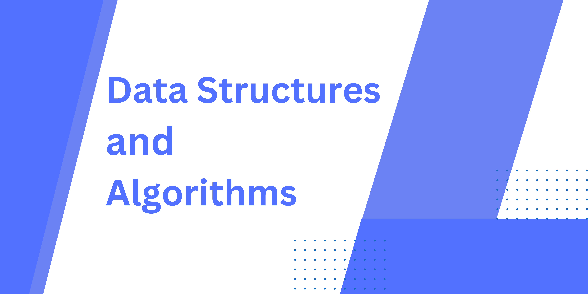

# Data Structures and Algorithms (Dsa)

              

This repository contains the Kotlin solutions with unit tests
for Data Structures and Algorithms. This 450 coding questions provided by <a href='https://github.com/loveBabbar' >Love Babbar</a>.

❌ If you notice any mistakes in the questions or solutions, please open an issue and note that the existing solutions may not be the best ones. Therefore, feel free to suggest better solutions with your contribution.

## Introduction
✅ Data structures and algorithms are two essential concepts in computer science and programming.

✅ Data structures refer to the way we organize and store data in a computer program. They are used to manage and manipulate data efficiently. Some common data structures include arrays, linked lists, stacks, queues, trees, and graphs.

✅ Algorithms, on the other hand, are a set of steps or instructions that are followed to solve a problem. Algorithms can range from simple to complex, depending on the problem being solved. Some common algorithms include searching, sorting, and traversal algorithms. 

✅ By choosing the right data structure and algorithm, programmers can write efficient and effective code that solves complex problems.

## Table of contents
- [Arrays](https://github.com/alidehkhodaei/dsa/tree/main/src/main/kotlin/array)
- [Matrix](https://github.com/alidehkhodaei/dsa/tree/main/src/main/kotlin/matrix)
- [Strings](https://github.com/alidehkhodaei/dsa/tree/main/src/main/kotlin/string)
- [Searching and Sorting](https://github.com/alidehkhodaei/dsa/tree/main/src/main/kotlin/searchingandsorting)
- [Linked List](https://github.com/alidehkhodaei/dsa/tree/main/src/main/kotlin/linkedlist)
- [Bit Manipulation](https://github.com/alidehkhodaei/dsa/tree/main/src/main/kotlin/bitmanipulation)
- [Greedy](https://github.com/alidehkhodaei/dsa/tree/main/src/main/kotlin/greedy)
- [Backtracking](https://github.com/alidehkhodaei/dsa/tree/main/src/main/kotlin/backtracking)
- [Dynamic Programming](https://github.com/alidehkhodaei/dsa/tree/main/src/main/kotlin/dynamicprogramming)
- [Stacks and Queues](https://github.com/alidehkhodaei/dsa/tree/main/src/main/kotlin/stackandqueue)
- [Binary Trees](https://github.com/alidehkhodaei/dsa/tree/main/src/main/kotlin/binarytree)
- [Binary Search Tree](https://github.com/alidehkhodaei/dsa/tree/main/src/main/kotlin/binarysearchtree)
- [Graphs](https://github.com/alidehkhodaei/dsa/tree/main/src/main/kotlin/graph)
- [Heap](https://github.com/alidehkhodaei/dsa/tree/main/src/main/kotlin/heap)
- [Trie](https://github.com/alidehkhodaei/dsa/tree/main/src/main/kotlin/trie)
 
## Usefull resource
- <a href="https://www.geeksforgeeks.org">Geeksforgeeks</a>
- <a href="https://www.programiz.com/dsa">Programiz</a>
- <a href="https://visualgo.net" >visualising dsa through animation</a>
- <a href="https://www.cs.usfca.edu/~galles/visualization/Algorithms.html" >Data Structure Visualizations</a>
- <a href="https://www.learnerslesson.com/Data-Structures-and-Algorithms/Algorithm.htm" >Learners lesson</a>
- <a href="https://www.hackerearth.com">Hackerearth</a>
- <a href="https://www.hackerrank.com">Hackerrank</a>
- <a href="https://www.leetcode.com">Leetcode</a>
- <a href="https://algorithm-visualizer.org">Algorithm visualizer</a>

## Contributing
1. Fork the repository.
2. Clone the forked repository to your local machine.
3. Create a new branch for your contribution.
4. Make changes, write unit test and documentation, commit them.
5. Push changes to your forked repository.
6. Open a pull request.

## License
This repository is licensed under the [MIT License](https://choosealicense.com/licenses/mit/).

